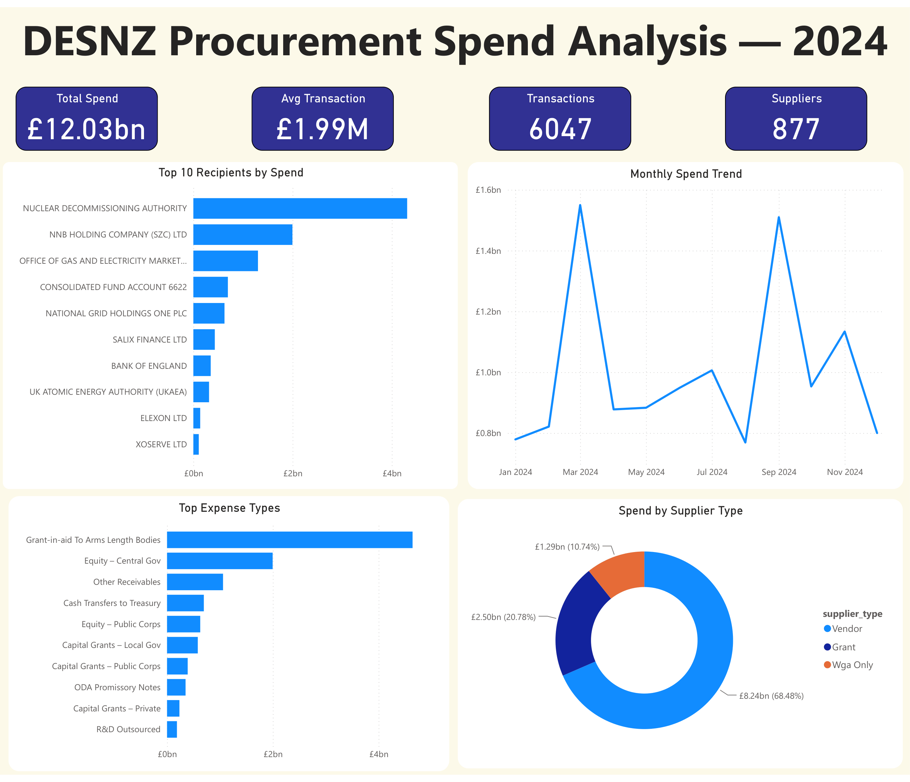

# DESNZ Procurement Spend Analysis — 2024

Analysis of **£12.03bn** of UK government departmental spending for the
Department for Energy Security & Net Zero (DESNZ) across calendar year 2024:
a full SQL data pipeline (clean → profile → model) feeding an interactive
Power BI dashboard, with a written set of findings and recommendations.

**Live dashboard:** _[paste your Publish-to-Web link here]_



---

## Why this project

DESNZ publishes every transaction over £25,000 as open data. That makes it a
realistic stand-in for the kind of **procurement / spend analytics** an energy
company runs internally — supplier concentration, spend timing, category mix,
and the data-quality work needed before any of it can be trusted. I chose an
energy-sector dataset deliberately: the questions here (where does spend
concentrate, what drives it, is it competitive procurement or grant transfer).

**Business question:** Where does DESNZ's spend actually go, when, and on what —
and what would a procurement team want to act on?

---

## Data

| | |
|---|---|
| **Source** | [DESNZ: departmental spending over £25,000](https://www.gov.uk/government/collections/desnz-departmental-spending-over-25000) (data.gov.uk, Open Government Licence) |
| **Period** | January–December 2024 (12 monthly files) |
| **Raw volume** | 6,050 transactions, 18 raw columns |
| **After cleaning** | 6,047 transactions, 10 analytical columns |
| **Total spend** | £12.03bn |

---

## Tools

- **DuckDB** (SQL engine) — loads the 12 CSVs, profiles, cleans, models, exports
- **Python** — orchestrates the pipeline (`run_pipeline.py`)
- **Power BI Desktop** — interactive dashboard
- **Git / GitHub** — version control

---

## Pipeline

```
data/raw/*.csv  →  load (DuckDB)  →  profile  →  clean + dedup  →  analyse  →  export  →  Power BI
```

1. **Load** — 12 monthly CSVs read together; resolved a non-UTF-8 encoding issue
   (the files are latin-1) before they would parse.
2. **Profile** (`sql/01_profiling.sql`) — measured nulls, types, duplicates, and
   cardinality *before* deciding any cleaning rule.
3. **Clean** (`sql/02_cleaning.sql`) — cast `Amount` from text to numeric, dropped
   8 columns that were ~85% empty, standardised supplier names, handled blanks
   with `COALESCE`/`NULLIF`, and de-duplicated **only** rows identical across all
   fields (3 rows) — deliberately preserving 159 transaction numbers that carry
   legitimate split-payment line items.
4. **Analyse** (`sql/03_analysis.sql`) — headline KPIs, supplier concentration,
   monthly trend, and an expense-type High/Medium/Low classification.
5. **Export** — a clean CSV (`data/processed/desnz_clean.csv`) for Power BI.

> The `.sql` files are the documented, reviewable version of the logic;
> `run_pipeline.py` is what actually executes it through DuckDB.

---

## Key findings

1. **Spend is extremely concentrated — but in public bodies, not vendors.**
   The top 10 recipients account for **85.4%** of all spend (top 50: 92.6%).
   But those recipients are arm's-length bodies and infrastructure programmes
   (Nuclear Decommissioning Authority £4.3bn, Sizewell C £2.0bn, Ofgem £1.3bn) —
   so this reflects **grant and investment transfer**, not competitive
   procurement concentration.

2. **Two spending spikes, with different causes.** March (£1.55bn) is the
   UK fiscal year-end surge. September (£1.51bn) is driven by a *few very large*
   payments — it has the **fewest transactions of any month** (409), so it's
   lumpy capital movement, not broad activity.

3. **The spend-type mix is more balanced than the recipient list suggests.**
   By supplier type, spend is 68% Vendor / 21% Grant / 11% WGA-only — so despite
   public bodies topping the recipient table, a real competitive-vendor component
   exists underneath.

Full reasoning and recommendations: [`insights/findings_and_recommendations.md`](insights/findings_and_recommendations.md)

---

## Repository structure

```
desnz-procurement-analytics/
├── README.md
├── run_pipeline.py              # load → profile → clean → analyse → export
├── data/
│   ├── raw/                     # 12 monthly DESNZ CSVs (2024)
│   └── processed/               # cleaned export for Power BI
├── sql/
│   ├── 01_profiling.sql
│   ├── 02_cleaning.sql
│   └── 03_analysis.sql
├── dashboard/
│   ├── procurement_dashboard.pbix
│   └── dashboard_screenshot.png
└── insights/
    └── findings_and_recommendations.md
```

---

## Reproduce

```bash
pip install duckdb pandas
python run_pipeline.py
```

The script loads `data/raw/*.csv`, runs the full pipeline, prints the profiling
and analysis output, and writes `data/processed/desnz_clean.csv`. Open the
`.pbix` in Power BI Desktop and point it at that file to rebuild the dashboard.

---

## Notes & limitations

- The £25,000 file blends operational procurement with grant/equity transfers;
  some "expense types" are accounting movements (e.g. cash transfers to Treasury)
  rather than purchases — noted rather than removed.
- Expense-type labels were mapped from raw government accounting names to
  business-readable ones for clarity.
- Data is one calendar year; trend reads are within-year, not year-over-year.